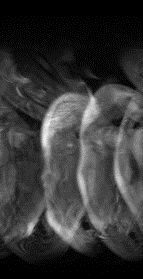
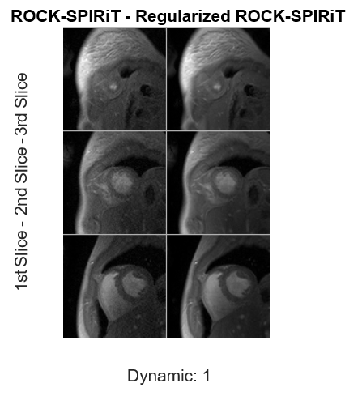

# Readout Concatenated K-Space SPIRiT (ROCK-SPIRIT)
This is an implementation of ROCK-SPIRIT(Demirel et al 2021).

© 2021 Regents of the University of Minnesota

ROCK-SPIRIT is copyrighted by Regents of the University of Minnesota. Regents of the University of Minnesota will license the use of ROCK-SPIRIT solely for educational and research purposes by non-profit institutions and US government agencies only. For other proposed uses, contact umotc@umn.edu. The software may not be sold or redistributed without prior approval. One may make copies of the software for their use provided that the copies, are not sold or distributed, are used under the same terms and conditions. As unestablished research software, this code is provided on an "as is'' basis without warranty of any kind, either expressed or implied. The downloading, or executing any part of this software constitutes an implicit agreement to these terms. These terms and conditions are subject to change at any time without prior notice.

Please cite the following:

Demirel OB, Weingärtner S, Moeller S, Akçakaya M. Improved simultaneous multislice cardiac MRI using readout concatenated k-space SPIRiT. Magn Reson Med. 2021;85:3036–3048.
https://doi.org/10.1002/mrm.28680

To run this code, please use main.m

RO:       # of readout lines,
PE:       # of phase encode lines,
NO_C:     # of coil elements,
Slices:   # of slices,
Dynamics: # of cardiac phases,

Input data:
- kspace (RO x PE x NO_C x Dynamics)
- acs (RO x PE x NO_C x Sices) with CAIPI shifts
- sense_maps (RO x PE x NO_C x Dynamics) with CAIPI shifts

Input data (shown in image domain):

Output data:
- recon_images (RO x PE x Slices x Dynamics) % ROCK-SPIRiT output
- recon_reg_images (RO x PE x Slices x Dynamics) % Regularized ROCK-SPIRiT output

Output data - Resuls (shown in image domain):

Readout concatenation is used to generate extended k-space and calibration region.
- Input: acquired k-space, acs (CAIPIRINHA shifted)
- Output: extended k-space, ROCK-SPIRiT kernels, kernel sizes

ROCK-SPIRiT
- Input: extended k-space, sensitivity maps, ROCK-SPIRiT kernels, kernel sizes,
         slice acceleration, #of CG iterations
- Output: reconstructed extended-kspace, reconstructed SENSE-1 Images
         
Regularized ROCK-SPIRiT
- Input: extended k-space, sensitivity maps, ROCK-SPIRiT kernels, kernel sizes,
         slice acceleration, #of CG iterations, # of ADMM loops
- Output: reconstructed extended-kspace, reconstructed SENSE-1 Images

Regularization:
- Locally low rank (LLR) regularization is supported via ADMM in regularized ROCK-SPIRiT
- To avoid border artifacts, CAIPIRINHA shifts are re-shifted/shifted before/after the regularization

